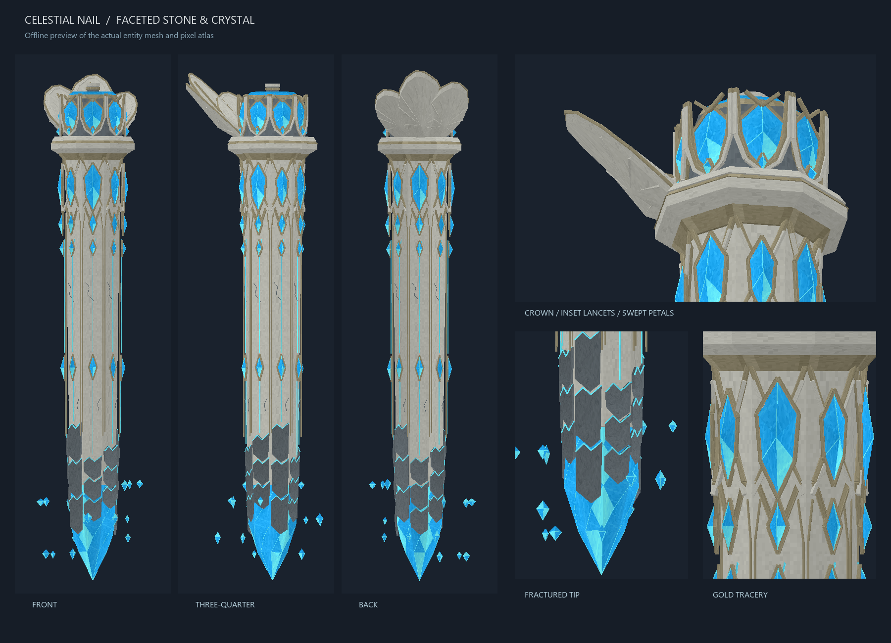
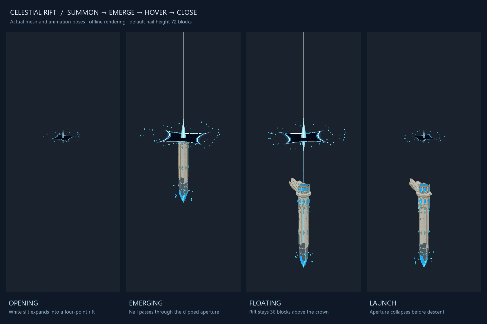

# Celestial Nail entity model

The reference is interpreted as an 72-block-tall Minecraft entity at scale 1. Its point stays at the entity origin; all dimensions scale uniformly, including culling bounds, crystal shards and the portal.

The shared, baked mesh includes an octagonal ivory shaft, raised gold arrises, cyan channels, framed diamond clasps, intersecting pointed arches, faceted lancet windows, a stepped crown collar, eight crown windows, and three asymmetric swept petals with inset panels and underside ribs. Three staggered layers of dark stone fragments surround a triangulated cyan crystal heart. Fifteen small crystal shards rotate separately around the point.

The atlas contains five original 16 × 16 pixel material swatches. Stone and metal receive world lighting; crystals and blue seams use full-bright light coordinates. Bloom depends on the player's shaders. Geometry is built once, then shared by all entities and all five loader targets. There are 7,590 quads in the nail including triangles encoded as quads for Minecraft's entity buffer. The renderer expands culling bounds to include the petals and orbiting shards.



This preview rasterizes the actual mesh and texture, but does not simulate Minecraft's shaders or world lighting. The fluid and scale behavior was also tested in a live NeoForge 1.21.1 dedicated server. In-game visual appearance and audio playback still need a client check.

## Portal



The four-point aperture has a dark interior, layered emissive rims, counter-rotating crystal motes and long tapered light rays. Its opening, seven-second emergence and closing animation use the synchronized world clock. The anchor is 1.5 nail heights above the command tip, leaving 36 blocks of clearance over a default 72-block nail once it settles. The ten-second opening sound fades out over its last two seconds. The nail mesh is clipped against the aperture during emergence. On launch the portal collapses before descent; its position does not follow the falling entity.

## Verification

`gradlew.bat buildAll :common:test` builds all supported targets and runs geometry checks for finite unit normals, material indices, render bounds, the geometry budget, and emissive shard classification, alongside the existing math tests. Every output jar must contain `assets/celestial_nail/textures/entity/celestial_nail.png` and `CelestialNailMesh.class`.

## Reproduce the offline preview

With Java 17+ and Python with Pillow and NumPy installed, from the repository root:

```powershell
python tools/generate_nail_texture.py
javac -d build/mesh-preview common/src/main/java/com/nstut/celestialnail/client/CelestialNailMesh.java tools/ExportNailMesh.java
java -cp build/mesh-preview ExportNailMesh | Set-Content build/nail-mesh.txt
python tools/preview_nail.py
```

The preview uses the Windows Segoe UI font. The texture generator and preview tools are development utilities and are not needed by the mod at runtime.

## Live fluid regression

`neoforge-1.21.1:runSmokeServer` starts an isolated development server in `neoforge-1.21.1/run/portal-smoke`. Configure that disposable server with local RCON and `level-name=fluid-scale-test`, then run `python tools/smoke_nail.py`. The script deliberately refuses other world names, exercises default/custom scaling and premature launch rejection, destroys a test reservoir of water/lava/waterlogged blocks, verifies the 1,053-cell cleared volume and outside-fluid preservation, then shuts down the test server. It does not touch a player world.

To regenerate the portal contact sheet, compile `tools/ExportPortalScene.java` with the shared mesh, clipper and visual-timeline classes, export its output to `build/portal-scene.txt`, then run `python tools/preview_portal.py`.
